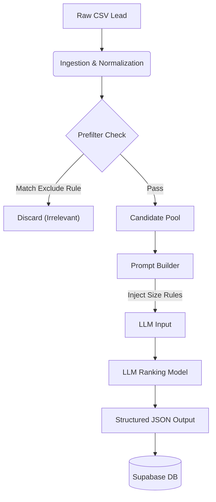

# Persona Ranker

A high-performance lead ranking system that maps organizational hierarchies and scores buying intent using LLMs.

> **Live Demo:** [persona-ranker-five.vercel.app](https://persona-ranker-five.vercel.app)
> **Documentation:** [persona-ranker-five.vercel.app/docs](https://persona-ranker-five.vercel.app/docs)

---

## 🏗️ Architecture: Feature-Sliced

This project follows a **Feature-Sliced Architecture**, optimized for scalability and maintenance. Code is organized by **Domain** (what it does) and **Layer** (what it is), ensuring clear separation of concerns and making the codebase intuitive to navigate.

### Directory Structure

```bash
src/
├── core/                       # Infrastructure & Shared Utilities
│   ├── db/client.ts           # Supabase client singleton
│   ├── api-response.ts        # Standardized API responses
│   └── errors.ts              # Custom error types
│
├── features/                   # Business Logic (The "Brain")
│   ├── ranking/               # Lead Ranking Logic
│   │   ├── prefilter.ts       # Deterministic regex engine (saves ~40% cost)
│   │   └── prompt.ts          # Dynamic prompt construction
│   ├── ai/                    # LLM Integration
│   │   └── client.ts          # Multi-provider client (failover logic)
│   └── ingestion/             # Data Processing
│       └── normalization/     # Title/Company standardization rules
│
├── services/                   # Data Access Layer (The "Muscle")
│   ├── leads.ts               # Lead CRUD operations
│   ├── jobs.ts                # Job state management
│   └── api-keys.ts            # Secure key management
│
├── jobs/                       # Background Workers (Trigger.dev)
│   ├── rank-company.ts        # Main orchestration workflow
│   └── optimize-prompt.ts     # Autonomous enhancement agent
│
├── components/                 # UI Library
│   ├── leads/                 # Lead-specific visualizations
│   ├── ranking/               # Progress bars & cost tickers
│   └── ui/                    # Reusable primitives (shadcn/ui)
```

---

## ⚡ The Pipeline

How a lead travels from CSV to Ranked Result:



---

## 💡 Key Technical Highlights

1.  **Multi-Provider AI Client (`src/features/ai/client.ts`)**
    *   Implements a robust failover strategy. If Groq (Llama 3) rate-limits, it seamlessly hot-swaps to Google Gemini without dropping the request.

2.  **Self-Healing JSON Parser**
    *   LLMs often truncate output. Custom logic in `client.ts` automatically detects and repairs malformed JSON (closing arrays, fixing quotes) to prevent batch failures.

3.  **Deterministic Pre-Filtering (`src/features/ranking/prefilter.ts`)**
    *   A regex engine filters out obvious mismatches (HR, Interns) *before* the LLM call, reducing costs by ~40%.

4.  **Autonomous Optimization (`src/jobs/optimize-prompt.ts`)**
    *   An agent that uses the **ProTeGi** algorithm to self-improve prompts against a "Golden Dataset", rewriting its own instructions to maximize F1 scores.

---

## 🚀 Quick Start

1.  **Clone & Install**
    ```bash
    git clone https://github.com/Felixburton7/persona-ranker.git
    cd persona-ranker
    npm install
    ```

2.  **Environment Setup**
    ```bash
    cp .env.example .env.local
    # Fill in SUPABASE_URL, TRIGGER_API_KEY, etc.
    ```

3.  **Run Development**
    ```bash
    npm run dev          # Start Next.js App
    npx trigger.dev dev  # Start Background Workers
    ```

---

## ⚖️ Tradeoffs

*   **Gemini Flash vs. Pro**: Used the cheapest model (Flash) for zero running costs. A 4K context window limits the "Contextual Awareness" of very large companies.
*   **Optimization Loop**: The optimizer runs in isolation. Pushing the "winning" prompt to production currently requires a manual copy-paste.
