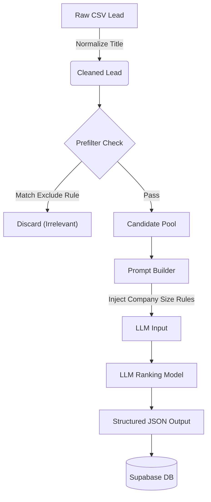

# Persona Ranker Challenge

> **Live Demo:** [persona-ranker-five.vercel.app](https://persona-ranker-five.vercel.app)  
> **Documentation:** [persona-ranker-five.vercel.app/docs](https://persona-ranker-five.vercel.app/docs)

This was a lot of fun to build! This "**Persona Ranker**" is a system for ranking leads against an Ideal Customer Profile (ICP). It automates the decision-making process of a human researcher, deciding who is a "Decision Maker," "Champion," or "Irrelevant" contact based on their title and company size.

It is built to be **high-precision** (using LLMs for reasoning) but **cost-effective** (using deterministic pre-filters to reduce token usage).

For a deeper dive into the methodology, check out the **[Architecture Docs](https://persona-ranker-five.vercel.app/docs)**.


  

---

## 📂 Project Structure Guide

The project is organized into three distinct layers:

| Layer | Component | Description |
|-------|-----------|-------------|
| **🧠 Logic** | [`src/lib/ranking/prefilter.ts`](src/lib/ranking/prefilter.ts) | **The Guardrails**. A deterministic Regex engine that filters out obvious mismatches (HR, Interns) *before* the LLM, saving ~40% cost. |
| **🧠 Logic** | [`src/lib/ranking/prompt.ts`](src/lib/ranking/prompt.ts) | **The Context Builder**. Constructs dynamic prompts with rubrics tailored to company size (e.g., *Startup* vs. *Enterprise* logic). |
| **💪 Muscle** | [`src/trigger/rank-company.ts`](src/trigger/rank-company.ts) | **The Worker**. The main background job that orchestrates validation, pre-filtering, batching, and LLM ranking. |
| **💪 Muscle** | [`src/trigger/optimize-prompt.ts`](src/trigger/optimize-prompt.ts) | **The Improver**. An autonomous agent that tests prompts against a "Golden Set" to iteratively improve accuracy. |
| **👀 Face** | [`src/app/page.tsx`](src/app/page.tsx) | **The Dashboard**. Next.js UI for uploading leads and monitoring real-time progress. |

---

## ⚡ The Ranking Pipeline

How a lead travels from CSV to Ranked Result:


```mermaid
flowchart TD
    A["Raw CSV Lead"] -->|"Normalize Title"| B("Cleaned Lead")
    B --> C{"Prefilter Check"}
    C -->|"Match Exclude Rule"| D["Discard (Irrelevant)"]
    C -->|"Pass"| E["Candidate Pool"]
    E --> F["Prompt Builder"]
    F -->|"Inject Company Size Rules"| G["LLM Input"]
    G --> H["LLM Ranking Model"]
    H --> I["Structured JSON Output"]
    I --> J[("Supabase DB")]
```

---

## 🚀 Quick Start

1. **Clone & Install**
   ```bash
   git clone [repo]
   cd persona-ranker
   npm install
   ```

2. **Environment Setup**
   Copy the example env file and fill in your keys (Supabase, Trigger.dev, Gemini/Groq).
   ```bash
   cp .env.example .env.local
   ```

3. **Run Locally**
   Start the dev server.
   ```bash
   npm run dev
   ```

4. **Trigger Development**
   In a separate terminal, forward the Trigger.dev worker to your local machine.
   ```bash
   npx trigger.dev@latest dev
   ```

---

## 🏗️ Architecture Decisions

1.  **Company-Centric Ranking**: We rank leads in the context of their *Company*. A "VP of Sales" means something very different at a 10-person startup vs. a 10,000-person corporation. The system handles this distinction natively.
2.  **Hybrid Filtering**: We don't send everyone to the LLM. The `prefilter.ts` layer acts as a cheap, fast sieve, ensuring we only spend money / compute on leads that are at least plausible.
3.  **Durable Execution**: Ranking 1,000 leads takes time. Trigger.dev ensures that if the API hangs or the process takes 5 minutes, it doesn't crash the UI or timeout the request.

For a deeper dive into the methodology, check out the **[Architecture Docs](https://persona-ranker-five.vercel.app/docs)**.
