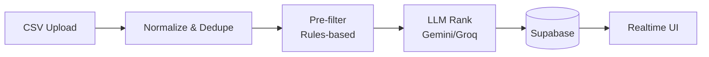

# Throxy Persona Ranker

A high-performance system for **ranking sales leads** against an ideal customer persona.

**Live Demo:** [persona-ranker.vercel.app](https://persona-ranker.vercel.app)

  

---

## Quick Start

```bash
git clone [repo] && cd persona-ranker && npm install
cp .env.example .env.local  # Add: SUPABASE_URL, SUPABASE_SERVICE_KEY, GROQ_API_KEY, TRIGGER_SECRET_KEY, GEMINI_API_KEY
npm run dev
```

---

## Key Files

| What | Where |
|------|-------|
| **Ranking Agent** | [`src/trigger/rank-company.ts`](src/trigger/rank-company.ts) |
| **Pre-filter Logic** | [`src/lib/ranking/prefilter.ts`](src/lib/ranking/prefilter.ts) |
| **Prompt Template** | [`src/lib/ranking/prompt.ts`](src/lib/ranking/prompt.ts) |
| **Prompt Optimizer** | [`src/trigger/optimize-prompt.ts`](src/trigger/optimize-prompt.ts) |
| **Scout Agent** | [`src/trigger/company-scout.ts`](src/trigger/company-scout.ts) |
| **Normalization** | [`src/lib/normalization/`](src/lib/normalization) |
| **DB Schema** | [`schema.sql`](schema.sql) |

---

## Architecture


```mermaid
flowchart LR
    A[CSV Upload] --> B[Normalize & Dedupe]
    B --> C[Pre-filter<br/>Rules-based]
    C --> D[LLM Rank<br/>Gemini/Groq]
    D --> E[(Supabase)]
    E --> F[Realtime UI]
```

### How It Works

1. **Ingestion** — CSV parsed, companies deduplicated via canonical key
2. **Pre-filter** — Rules exclude obvious non-fits (HR, Legal, Interns) → saves ~40% token costs
3. **LLM Ranking** — Leads ranked head-to-head within company context using Gemini/Groq
4. **Realtime** — Results stream to UI via Supabase subscriptions

---

## Key Decisions

| Decision | Why |
|----------|-----|
| **Company-batched ranking** | "VP Sales" at 10-person startup ≠ "VP Sales" at 5000-person enterprise. Context matters. |
| **Deterministic pre-filter** | Hard-code exclusions for clear non-fits before LLM. Faster + cheaper. |
| **Forced ranking (1,2,3...)** | No ties. Forces model to make trade-offs instead of arbitrary 1-100 scores. |
| **Trigger.dev for jobs** | Vercel times out at 60s. Trigger.dev handles long-running ranking with retries. |

---

## Tradeoffs

- **Batching vs Global Rank** — LLM never sees all leads at once. We use scores for final global sort.
- **Latency** — Full ranking takes 1-2 mins. Chose accuracy over speed, mitigated by realtime UI.
- **Complexity** — Trigger.dev + Supabase Realtime is heavier than a simple API, but solves timeouts.

---

## Bonuses Completed

- ✅ Cost tracking per AI call
- ✅ Sortable table by rank  
- ✅ Export top N per company to CSV
- ✅ Real-time ranking progress
- ✅ Automatic prompt optimization (APO/ProTeGi algorithm)

---

## Stack

Next.js 15 • Supabase (Postgres) • Trigger.dev v3 • Gemini/Groq • TailwindCSS + ShadCN
