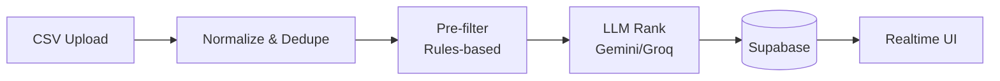

# Throxy Persona Ranker

> **Live Demo:** [persona-ranker-five.vercel.app](https://persona-ranker-five.vercel.app)  
> **Documentation:** [persona-ranker-five.vercel.app/docs](https://persona-ranker-five.vercel.app/docs)

A high-performance system for **ranking sales leads** against an ideal customer persona. It uses autonomous agents to enrich, filter, and rank contacts, maximizing relevance while minimizing token costs.

  

---

## Clean Architecture

The project is structured to separate concerns, ensuring scalability and maintainability:

- **Core Domain** (`src/lib`): Contains pure business logic.
  - `ranking/`: The LLM prompting strategies and scoring rubrics.
  - `normalization/`: Data cleaning rules.
  - `optimization/`: The self-improving prompt algorithms (APO).
- **Application Layer** (`src/trigger`): Handles orchestration and state management.
  - Durable background jobs (Agents) that manage long-running ranking tasks without timeouts.
- **Presentation** (`src/app`): Modern Next.js UI.
  - Subscribes to Supabase Realtime for live updates from the agents.

---

## Quick Start

```bash
git clone [repo] && cd persona-ranker && npm install
cp .env.example .env.local  # Add: SUPABASE_URL, SUPABASE_SERVICE_KEY, GROQ_API_KEY, TRIGGER_SECRET_KEY, GEMINI_API_KEY
npm run dev
```

---

## Key Files

| Component | Path | Description |
|-----------|------|-------------|
| **Ranking Agent** | [`src/trigger/rank-company.ts`](src/trigger/rank-company.ts) | Main workflow that processes companies. |
| **Logic Core** | [`src/lib/ranking/`](src/lib/ranking) | Contains `prefilter.ts` (rules) and `prompt.ts` (LLM logic). |
| **Prompt Optimizer** | [`src/trigger/optimize-prompt.ts`](src/trigger/optimize-prompt.ts) | Agent that improves the prompt using an eval set. |
| **Scout Agent** | [`src/trigger/company-scout.ts`](src/trigger/company-scout.ts) | Enriches company data from the web. |
| **DB Schema** | [`schema.sql`](schema.sql) | Postgres schema for leads, companies, and rankings. |

---

## Architecture Flow


```mermaid
flowchart LR
    A[CSV Upload] --> B[Normalize & Dedupe]
    B --> C[Pre-filter<br/>Rules-based]
    C --> D[LLM Rank<br/>Gemini/Groq]
    D --> E[(Supabase)]
    E --> F[Realtime UI]
```

### Key Decisions

1.  **Company-batched ranking**: We rank leads *per company* to allow the LLM to make relative comparisons (finding the *true* decision maker among peers).
2.  **Deterministic pre-filter**: Hard rules exclude obvious non-fits (Interns, HR) before the LLM touches them, saving ~40% cost.
3.  **Trigger.dev Orchestration**: Moves complex logic out of Vercel serverless functions to avoid timeouts and ensure durability.

For a deep dive into the trade-offs and design, check out the **[Architecture Docs](https://persona-ranker-five.vercel.app/docs)**.
